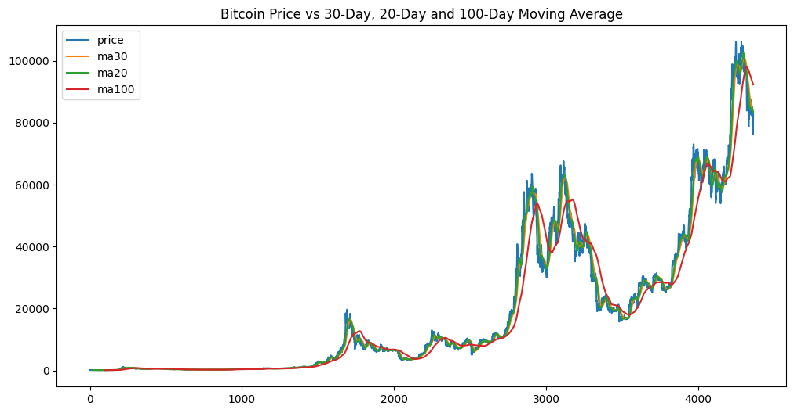
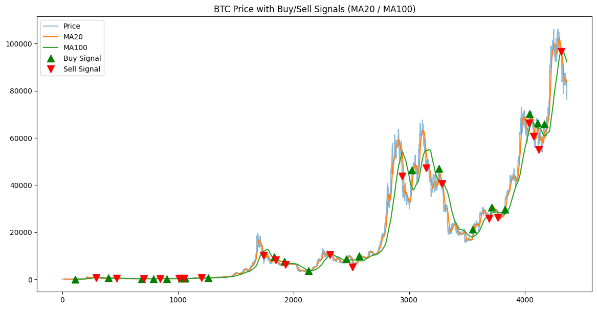
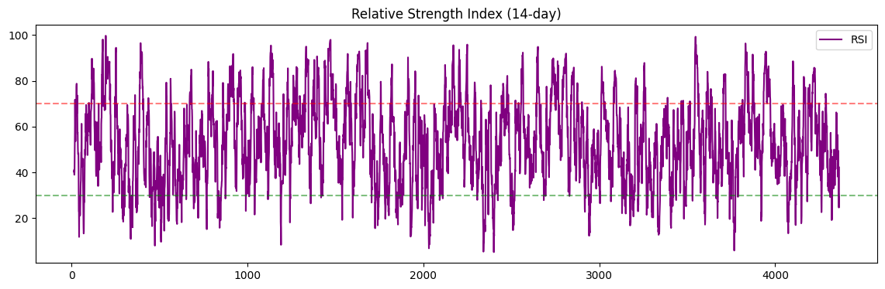

# 📈 Bitcoin Trend Analysis with Pandas

This project performs a full exploratory and technical analysis of Bitcoin (BTC) historical data using Python and Pandas. It includes trend visualization, moving averages, RSI, and a simple buy/sell signal strategy based on moving average crossovers.
---
## 📁 Project Structure

- `data/`
  - `btc-usd-max.csv` — raw data
  - `btc_trend_analysis.csv` — processed data
- `plots/`
  - `btc-ma.png`
  - `buy_sell_signals.png`
  - `RSI-14-day.png`
- `project.ipynb` — main analysis notebook
- `README.md` — project overview

## Features & Workflow

- Load and inspect BTC historical price data
- Data cleaning & date formatting
- Feature engineering:
  - Moving averages (20, 30, 100-day)
  - Daily returns
  - Volatility (30-day rolling std)
  - Volume/Market Cap ratio
- Buy/Sell signal detection based on MA20 vs MA100 crossovers
- RSI (Relative Strength Index) for momentum detection
- Clean Matplotlib visualizations

## Insights

This project shows how to:
- Prepare and clean time series crypto data
- Apply key financial indicators
- Spot market trends visually
- Build simple trading logic with Pandas

## Tools Used

- Python (Pandas, NumPy, Matplotlib)
- Jupyter Notebook
- VS Code

## Preview

